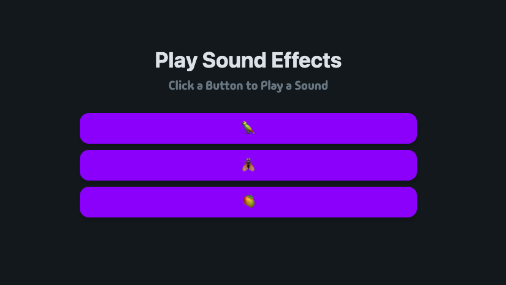

# Aplicação Web de Efeitos Sonoros

Uma aplicação web simples e engraçada de efeitos sonoros.

## Tecnologias Utilizadas :computer:

- HTML5 :orange_book:
- CSS :art:
- JavaScript :yellow_heart:

## Autor :bust_in_silhouette:

Desenvolvido por [Bernardo Zamin](https://github.com/Bernardo-Zamin)
